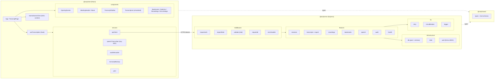

# Component Diagram

```mermaid
flowchart LR
  subgraph Client["@smj/client (React)"]
    App["App / TranscriptPage"]
    Hook["useTranscription (hook)"]
    subgraph CSvc["services"]
      ApiC["apiClient"]
      SpeechC["speechTranscriber (lazy SDK)"]
      Rec["audioRecorder"]
      Backup["transcriptBackup"]
      PrintS["print"]
    end
    subgraph CUI["components"]
      Opening["OpeningScreen"]
      Header["MeetingHeader / About"]
      Toolbar["TranscriptToolbar"]
      List["TranscriptList (virtualized)"]
      Panels["Bookmarks / Statistics / Recordings / Error dialogs"]
    end
    TeamsC["teams/teamsClient (SSO, context)"]
  end

  subgraph Shared["@smj/shared"]
    Types["types + Zod schemas"]
  end

  subgraph Server["@smj/server (Express)"]
    subgraph MW["middleware"]
      Auth["requireAuth"]
      RBAC["requireRole"]
      Valid["validate (Zod)"]
      ReqId["requestId"]
      Err["errorHandler"]
    end
    subgraph Feat["features"]
      SessF["sessions"]
      TransF["transcripts + export"]
      RecF["recordings"]
      BookF["bookmarks"]
      SpeechF["speech"]
      AuditF["audit"]
      HealthF["health"]
    end
    subgraph Infra["infrastructure"]
      DB["db (pool + schema)"]
      BlobI["blob"]
      AuthI["auth (Entra JWKS)"]
    end
    subgraph Lib["lib"]
      Retry["retry"]
      CB["circuitBreaker"]
      Log["logger"]
    end
  end

  App --> Hook --> CSvc
  App --> CUI
  App --> TeamsC
  ApiC -->|HTTPS Bearer| MW --> Feat --> Infra
  Feat --> Lib
  Client -. types .-> Shared
  Server -. types .-> Shared
```

---

**Designed and Developed by Mohammed Al-Maabdi** (mbmaabdi@moj.gov.sa)
Ministry of Justice — Kingdom of Saudi Arabia
