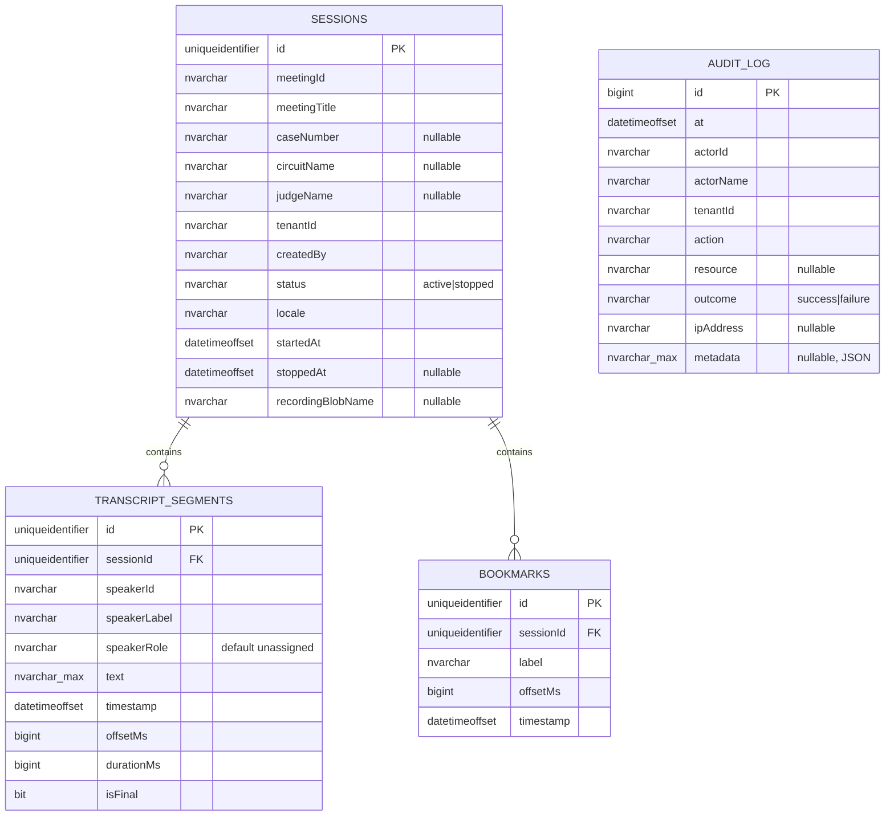

# Database ER Diagram

## Constraints & indexes

- `TranscriptSegments.sessionId` → `Sessions.id` **ON DELETE CASCADE**;
  `Bookmarks.sessionId` → `Sessions.id` **ON DELETE CASCADE**.
- Indexes: `Sessions(meetingId)`, `Sessions(tenantId)`,
  `TranscriptSegments(sessionId, offsetMs)`, `Bookmarks(sessionId, offsetMs)`,
  `AuditLog(tenantId, at DESC)`.
- `AuditLog` is standalone (no FK) so audit survives session deletion.
- Schema is created idempotently on startup with **additive** migrations.

---

**Designed and Developed by Mohammed Al-Maabdi** (mbmaabdi@moj.gov.sa)
Ministry of Justice — Kingdom of Saudi Arabia
