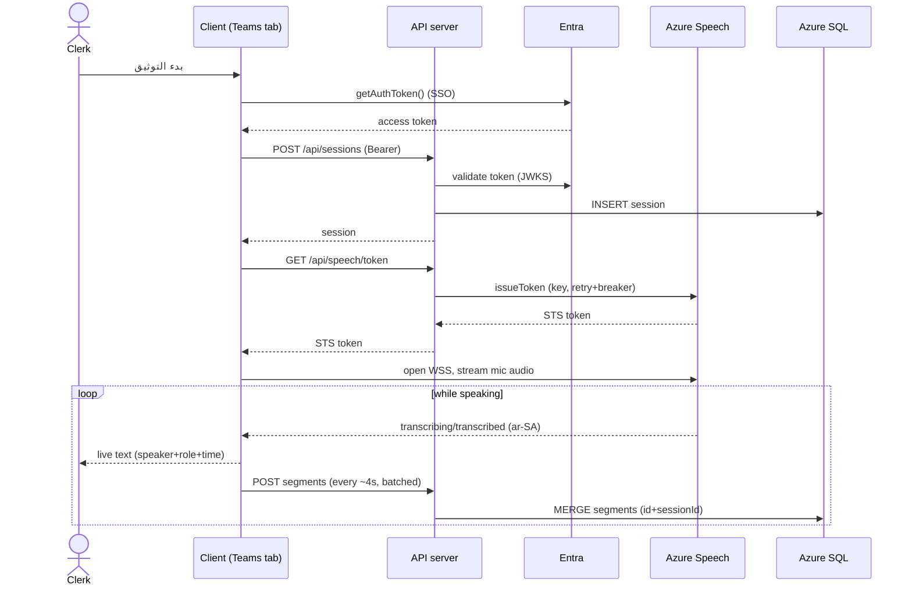
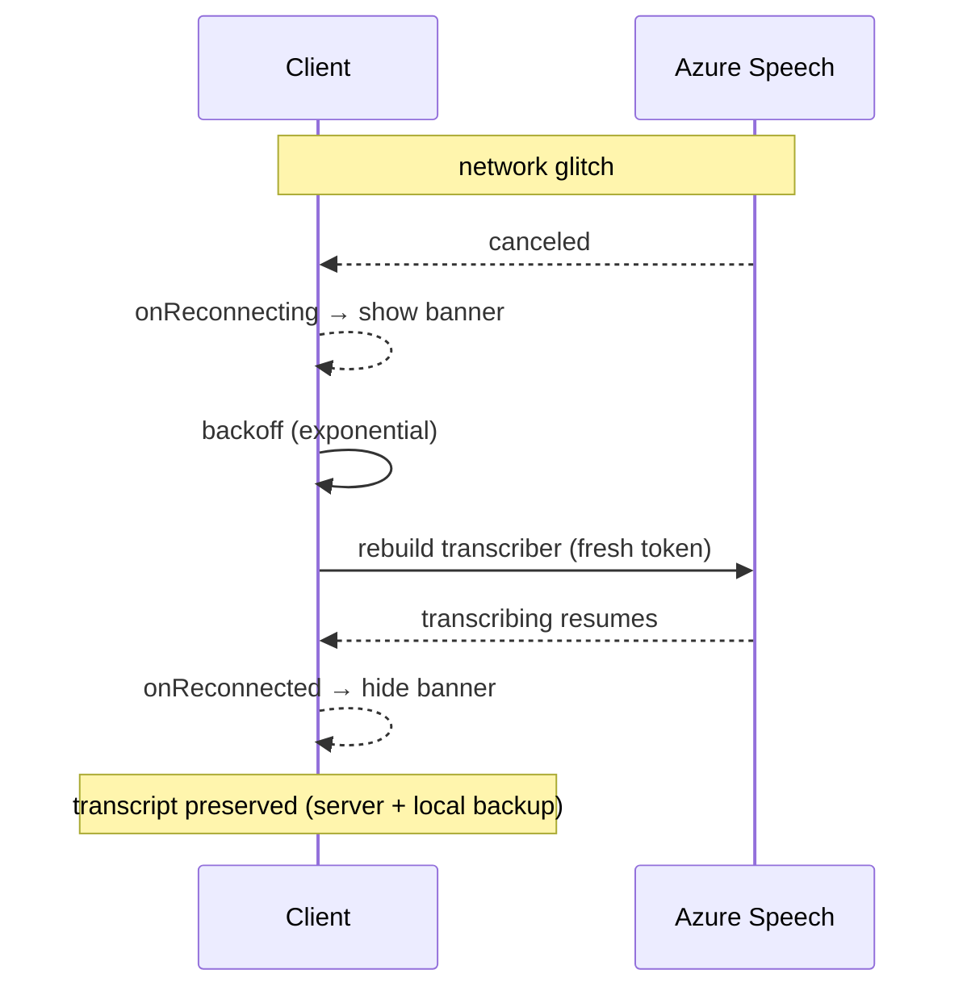
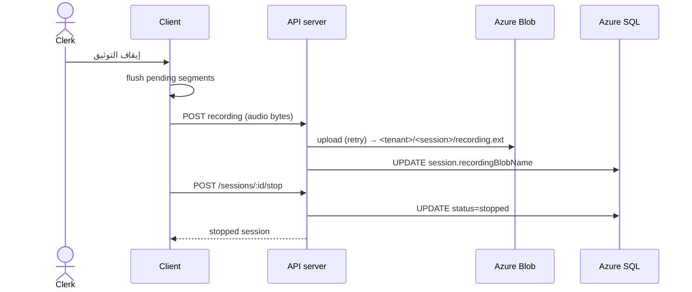
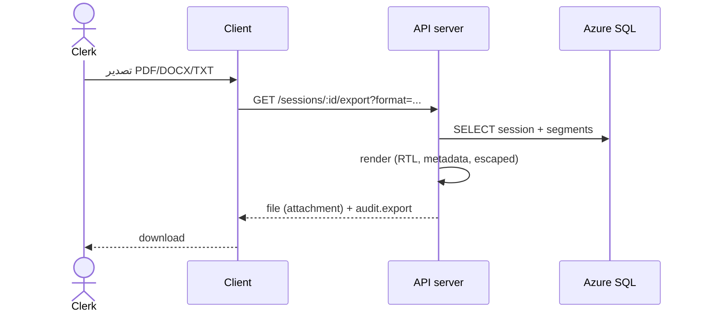

# Sequence Diagrams

## 1. Start documentation → live transcription

## 2. Reconnect after a transient Speech disconnect

## 3. Stop → save recording

## 4. Export transcript

---

**Designed and Developed by Mohammed Al-Maabdi** (mbmaabdi@moj.gov.sa)
Ministry of Justice — Kingdom of Saudi Arabia
