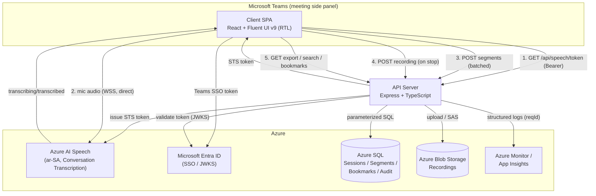

# System Architecture Diagram

## Notes

- The **Speech subscription key never reaches the browser**; the client uses a
  short-lived STS token to talk to Azure Speech directly.
- The API validates every request's Entra token and enforces tenant-scoped RBAC.
- The client is stateless static hosting; the API is a stateless container.

---

**Designed and Developed by Mohammed Al-Maabdi** (mbmaabdi@moj.gov.sa)
Ministry of Justice — Kingdom of Saudi Arabia
